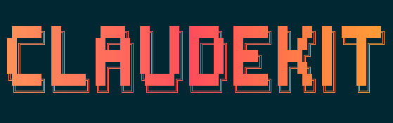

# claudekit

> Intelligent guardrails and workflow automation for Claude Code - catch errors in real-time, save checkpoints, and enhance AI coding with expert subagents

[](https://www.npmjs.com/package/claudekit)
[](https://opensource.org/licenses/MIT)
[](https://nodejs.org)

## 🚀 Installation

> **⚠️ Requires:** Claude Code **Max plan** (for optimal token usage) • Node.js 20+

```bash
npm install -g claudekit
# or: yarn global add claudekit
# or: pnpm add -g claudekit
```

## ⚡ Quick Start

```bash
# Initialize in your project
claudekit setup

# In Claude Code, try these commands:
/git:status                      # Groups changes by type & suggests commit strategy
/spec:create "your next feature" # Researches codebase & writes full spec
/code-review                     # 6 specialized agents analyze code in parallel
```

## 🎯 What It Does

Claudekit acts as your safety net while coding with Claude:

```
Before: Claude adds 'any' type → ❌ Lost type safety discovered in code review
After:  Claude adds 'any' type → ✅ Instant block: "Use specific type: User | null"

Before: Risky refactor fails → ❌ Git archaeology to find working version  
After:  Risky refactor fails → ✅ One command: /checkpoint:restore

Before: Claude breaks tests → ❌ You discover it after Claude finishes
After:  Claude breaks tests → ✅ Claude sees error immediately and fixes it

Before: Ask Claude to review → ❌ Shallow analysis, general feedback, sequential execution
After:  Use /code-review → ✅ 6 specialized agents analyze in parallel, dynamically pull technology-specific expertise
```

## Key Features

### 🗺️ Instant Codebase Navigation
**Claude sees your entire project structure automatically - skips most discovery searches.**
- **Navigate directly to code** - Jump straight to files, functions, and classes
- **No trial-and-error** - Avoid sifting through test files, docs, and irrelevant matches  
- **Confident code access** - Claude knows exactly what exists and where
- **See relationships** - Claude understands dependencies and architecture instantly
- **Automatic setup** - Runs invisibly on first prompt, updates as you code

### 🔍 Comprehensive Code Review
- **Multi-aspect analysis**: 6 parallel agents for architecture, security, performance, testing, quality, and documentation
- **Intelligent targeting**: Automatically selects relevant review agents based on file types and scope
- **Structured reports**: Prioritized issues (Critical/High/Medium) with type icons and actionable solutions
- **Quality metrics**: Scoring system and issue distribution tracking for measurable improvements

### 🚀 Iterative Spec Implementation
- **6-phase workflow**: Implementation → Test Writing → Code Review → Iterative Improvement → Commit → Progress Tracking
- **Dynamic agent selection**: Real-time detection of available specialized agents with intelligent fallbacks
- **Quality gates**: Each phase includes validation before proceeding to ensure high-quality deliverables
- **Atomic commits**: Standardized commit messages with comprehensive change documentation

### 🛡️ Real-time Error Prevention
- **🔒 Sensitive File Protection**: Blocks AI access to `.env` files, API keys, SSH keys, and credentials before they're accessed
- **TypeScript Guard**: Blocks `any` types and type errors as Claude edits
- **Linting**: Catches style issues immediately  
- **Anti-patterns**: Prevents code replacement with comments
- **Test Runner**: Runs relevant tests on file changes
- **Multi-tool ignore file support**: Respects `.agentignore`, `.aiignore`, `.aiexclude`, `.geminiignore`, `.codeiumignore`, `.cursorignore`

### 💾 Git Checkpoint System
- **Auto-save**: Creates checkpoints when Claude stops
- **Easy restore**: `/checkpoint:restore` to undo changes
- **Checkpoint management**: List, restore, or clean up checkpoints

### 🤖 AI Subagents
- **Code Search**: `code-search` for fast, parallel codebase searches with 3-10x speed improvements
- **Triage Expert**: `triage-expert` for initial problem diagnosis and routing to specialists
- **Domain experts**: TypeScript, React, database, testing, infrastructure, documentation specialists
- **Code review**: Dedicated `code-review-expert` agent with 6 focused analysis aspects
- **Framework specialists**: Next.js, Nest.js, AI SDK, and build tool experts
- **Performance optimization**: Intelligent hook management with `disableHooks` configuration to skip unnecessary validations during specialized operations
- **Mandatory delegation**: All technical issues MUST be handled by specialized subagents
- **Proactive help**: Run `/agents-md:init` to update AGENTS.md/CLAUDE.md for automatic subagent delegation

### 📊 Hook Performance Profiling
- **Performance monitoring**: Analyze hook execution time and output size with `claudekit-hooks profile`
- **Batch analysis**: Automatically profiles all configured hooks from `.claude/settings.json`
- **Statistical analysis**: Support for multiple iterations with averaging for accurate measurements
- **Smart warnings**: Color-coded alerts for slow hooks (>5s) and output size limits
- **Claude Code integration**: Specialized limits for UserPromptSubmit hooks that inject context
- **Token estimation**: Calculate estimated token usage for hook outputs

### 📝 Smart Commands
- `/code-review` - Multi-aspect code reviews with 6 parallel agents
- `/git:commit` - Creates commits following your project's conventions
- `/validate-and-fix` - Runs all quality checks and fixes issues
- `/spec:create` - Generates comprehensive specifications
- `/spec:execute` - Implements specifications with iterative quality assurance workflow
- `/create-subagent` - Build custom AI assistants

## CLI Commands

```bash
claudekit setup              # Interactive setup wizard
claudekit setup --yes        # Quick setup with defaults
claudekit setup --all        # Install everything (all agents)
claudekit list               # Show all components (hooks, commands, agents, config)
claudekit list agents        # List available agents with token counts
claudekit list commands      # List available commands with token counts
claudekit show agent <id>    # Display agent prompt for external use
claudekit show command <id>  # Display command prompt for external use
claudekit show agent <id> -f json    # Output agent metadata and content as JSON
claudekit show command <id> -f json  # Output command metadata and content as JSON
claudekit doctor             # Check your installation and validate documentation links

# Hook management and profiling
claudekit-hooks run <hook>   # Execute a specific hook manually
claudekit-hooks profile      # Profile all configured hooks performance
claudekit-hooks profile <hook> --iterations 5  # Profile specific hook with averaging
```

### Using Prompts with External LLMs

The `show` command extracts agent and command prompts for use with Claude Code's non-interactive mode and other AI coding tools:

```bash
# Extract agent prompt for use with Claude Code CLI
EXPERT=$(claudekit show agent typescript-expert)
cat src/app.ts | claude -p --append-system-prompt "$EXPERT" "Review this code"

# Get structured metadata for integration with tools
claudekit show agent typescript-expert --format json | jq '.description'

# Works with any AI coding CLI tool
claudekit show agent react-expert | amp -x "Fix React hooks violations"
```

See the [external LLMs guide](docs/guides/using-prompts-with-external-llms.md) for examples with Claude Code, Amp, Gemini CLI, and others.

## Slash Commands

Use these commands directly in Claude Code:

### Git & Checkpoints
- `/checkpoint:create [msg]` - Save current state
- `/checkpoint:restore [n]` - Restore to checkpoint
- `/checkpoint:list` - View all checkpoints
- `/git:commit` - Smart commit with conventions
- `/git:status` - Intelligent git analysis

### Code Quality
- `/code-review [target]` - Multi-aspect code review with parallel agents
- `/validate-and-fix` - Run all quality checks

### Development Tools
- `/spec:create [feature]` - Generate specifications
- `/spec:execute [file]` - Implement specifications with 6-phase iterative workflow
- `/agents-md:init` - Configure AI assistants
- `/create-subagent` - Build custom agents
- `/create-command` - Create custom commands

[View all commands →](docs/reference/commands.md)

## Hooks

Hooks automatically enforce quality as Claude works:

### Available Hooks

**File Security Hooks** (PreToolUse - run before file access)
- `file-guard` - Block AI access to sensitive files (`.env`, keys, credentials) using ignore file patterns

**File Change Hooks** (PostToolUse - run on edit)
- `typecheck-changed` - Run TypeScript type checking on file changes
- `lint-changed` - Run ESLint validation on changed files
- `test-changed` - Run tests for changed files
- `check-any-changed` - Forbid any types in changed TypeScript files
- `check-comment-replacement` - Detect when code is replaced with comments
- `check-unused-parameters` - Detect lazy refactoring where parameters are prefixed with _ instead of being removed

**UserPromptSubmit Hooks** (run on first user prompt of each session)
- `codebase-map` - Provide invisible codebase context once per session using codebase-map CLI
- `thinking-level` - Inject thinking level keywords to enhance Claude's reasoning capabilities

**PostToolUse Hooks** (also includes file monitoring)
- `codebase-map-update` - Incrementally update codebase map when files change

**Project-Wide Hooks** (typically for Stop/SubagentStop events)
- `typecheck-project` - TypeScript validation on entire project
- `lint-project` - ESLint validation on entire project
- `test-project` - Run full test suite
- `create-checkpoint` - Git auto-checkpoint on stop
- `check-todos` - Validate todo completions
- `self-review` - Enhanced targeted self-review with implementation completeness detection, prioritizing mock implementations, placeholder code, and incomplete features over code quality concerns

### Hook Events

- **PreToolUse** - Triggered before file access (Read, Write, Edit, MultiEdit) for permission control
- **PostToolUse** - Triggered after file modifications (Write, Edit, MultiEdit)
- **Stop** - Triggered when Claude Code stops or conversation ends
- **SubagentStop** - Triggered when subagents complete their tasks
- **UserPromptSubmit** - Triggered when users submit their first prompt in a session

### Hook Commands

```bash
# See all available hooks with descriptions
claudekit-hooks list

# Profile hook performance and output size
claudekit-hooks profile                   # Profile all hooks
claudekit-hooks profile typecheck-changed  # Profile specific hook
claudekit-hooks profile --iterations 5    # Multiple runs for averages
```

The profile command helps identify:
- Slow hooks (>5s) that delay your workflow
- High-output hooks that consume context window
- UserPromptSubmit hooks approaching the 10k character limit

[Hook configuration →](docs/reference/hooks.md) | [Profiling guide →](docs/guides/hook-profiling.md)

## Subagents

Specialized AI assistants for different domains:

**Popular Agents**
- `code-review-expert` - 6-agent parallel code review (architecture, security, performance, testing, quality, docs)
- `triage-expert` - Context gathering and problem diagnosis routing to specialized experts
- `documentation-expert` - Documentation structure, cohesion, flow, and information architecture specialist
- `oracle` - Deep debugging and complex problem analysis ([requires setup](docs/integrations/oracle.md))
- `refactoring-expert` - Code smell detection and comprehensive refactoring guidance
- `typescript-expert` - TypeScript/JavaScript development and type system
- `react-expert` - React components, hooks, and performance
- `testing-expert` - Test strategy, coverage, and best practices
- `database-expert` - Query optimization and schema design
- `ai-sdk-expert` - Vercel AI SDK v5 streaming and model integration
- `nestjs-expert` - Nest.js architecture and dependency injection

**Usage**
```bash
# List all available agents with token counts
claudekit list agents

# Install specific agents
claudekit setup --agents typescript-expert,react-expert
```

Once installed, agents work automatically or can be invoked directly:
```
"Use the oracle agent to debug this issue"
"Have the typescript-expert review this type definition"
```

[View all agents →](docs/reference/subagents.md)

## Security

### Protecting Sensitive Files

The `file-guard` hook automatically protects sensitive files from AI access. Quick setup:

```bash
# New projects: Install claudekit with file-guard protection
npm install -g claudekit && claudekit setup --yes --force --hooks file-guard

# Existing projects: Add file-guard to current setup
claudekit setup --hooks file-guard
```

Or manually create a `.agentignore` file:

```gitignore
# .agentignore
.env
.env.*
*.key
*.pem
.aws/credentials
.ssh/*

# Allow example files
!.env.example
```

The `file-guard` hook supports multiple ignore file formats (`.agentignore`, `.aiignore`, `.cursorignore`, `.geminiignore`, `.codeiumignore`, `.aiexclude`) and merges patterns from all of them - a unique feature that provides comprehensive protection regardless of which AI tools your team uses.

**Key features:**
- Merges patterns from ALL ignore files (unlike other tools)
- Supports gitignore-style syntax including negation (!)
- Resolves symlinks to prevent bypasses
- Blocks path traversal attempts outside project

See the [File Guard Guide](docs/guides/file-guard.md) for detailed configuration and best practices.

### 🗺️ Automated Codebase Context

Claudekit provides intelligent codebase mapping that automatically gives AI assistants comprehensive project context:

- **Automatic context provision** - Claude receives your project structure at session start
- **Live updates** - Map stays current as files change during development
- **Configurable filtering** - Focus on relevant code and exclude tests/dependencies
- **Multiple output formats** - DSL, tree, markdown, and JSON formats optimized for different use cases
- **Session awareness** - Loads once per session, avoiding repetitive context

See the [Codebase Map Guide](docs/guides/codebase-map.md) for setup, configuration, and best practices.

## Configuration

Claudekit uses two configuration files:

**`.claude/settings.json`** - Project settings (hooks, commands)
```json
{
  "hooks": {
    "PreToolUse": [{
      "matcher": "Read|Edit|MultiEdit|Write",
      "hooks": [{"type": "command", "command": "claudekit-hooks run file-guard"}]
    }],
    "PostToolUse": [{
      "matcher": "Write|Edit|MultiEdit",
      "hooks": [{"type": "command", "command": "claudekit-hooks run typecheck-changed"}]
    }],
    "Stop": [{
      "matcher": "*",
      "hooks": [{"type": "command", "command": "claudekit-hooks run create-checkpoint"}]
    }],
    "SubagentStop": [{
      "matcher": "*",
      "hooks": [{"type": "command", "command": "claudekit-hooks run create-checkpoint"}]
    }],
    "UserPromptSubmit": [{
      "matcher": "*",
      "hooks": [{"type": "command", "command": "claudekit-hooks run codebase-map"}]
    }]
  }
}
```

**`.claudekit/config.json`** - Hook configuration
```json
{
  "hooks": {
    "typecheck-changed": {
      "command": "npm run typecheck"
    },
    "thinking-level": {
      "enabled": true,
      "level": 2
    },
    "codebase-map": {
      "include": ["src/**", "lib/**"],
      "exclude": ["**/*.test.ts", "**/*.spec.ts"],
      "format": "dsl"
    }
  }
}
```

[Configuration guide →](docs/getting-started/configuration.md)

## Getting Help

- **Documentation**: [Full docs](docs/)
- **Issues**: [GitHub Issues](https://github.com/carlrannaberg/claudekit/issues)
- **Quick test**: `claudekit doctor` to check setup

## Common Issues

**Hooks not triggering?**
```bash
claudekit doctor                # Check configuration
npm list -g claudekit           # Verify installation
```

**Tests timing out?**
Use the ultra-fast test configuration for hook execution:
```json
{
  "hooks": {
    "test-project": {
      "command": "npm run test:fast",
      "timeout": 30000
    }
  }
}
```

Or configure a custom faster test command:
```json
{
  "hooks": {
    "test-project": {
      "command": "npm run test:unit",
      "timeout": 50000
    }
  }
}
```

**Codebase map not generating?**
Install the codebase-map CLI tool:
```bash
npm install -g codebase-map
# Check installation:
codebase-map --version
```

[Full troubleshooting →](docs/getting-started/troubleshooting.md)

## MCP Integration

Some commands support optional MCP server integration:

### Context7 (for documentation access)
```bash
# Install globally
npm install -g @upstash/context7-mcp

# Add to Claude Code
claude mcp add context7 context7-mcp
```

Enables `/spec:create` to fetch up-to-date library documentation.

## Development

```bash
# Clone and install
git clone https://github.com/claudekit/claudekit.git
cd claudekit
npm install

# Build
npm run build

# Test
npm test

# Validate production build
npm run validate:build         # Check dependencies and build artifacts
npm run validate:install       # Test clean installation

# Create symlinks for development
npm run symlinks
```

## Contributing

We welcome contributions! See [CONTRIBUTING.md](CONTRIBUTING.md) for guidelines.

## License

MIT © [claudekit contributors](https://github.com/carlrannaberg/claudekit/graphs/contributors)