# Session-Based Hook Disable/Enable System Specification

**Status**: Draft  
**Authors**: Claude, 2025-01-01  
**Version**: 1.0.0

## Overview

This specification outlines the implementation of a session-based hook disable/enable system for claudekit. The system allows users to temporarily disable specific hooks for individual Claude Code sessions without affecting other concurrent sessions or making permanent configuration changes. Users can control hook execution through intuitive slash commands (`/hook:disable` and `/hook:enable`) with intelligent fuzzy matching and contextual feedback.

## Background/Problem Statement

Currently, claudekit hooks operate with global on/off states. Users face an all-or-nothing choice: either have hooks always enabled (potentially disruptive during experimentation or specific workflows) or globally disable them (losing benefits across all sessions). This creates friction when:

- Users want to temporarily disable type checking while rapidly prototyping
- Specific hooks interfere with certain types of development work  
- Users run multiple Claude Code sessions with different requirements
- Teams need different hook configurations for different project phases

The existing hook system provides subagent-based disabling and global configuration, but no session-specific temporary control. Users currently cannot say "disable this hook for my current session while keeping it active everywhere else."

## Goals

- Implement session-based hook state management using transcript-based session identification
- Provide intuitive `/hook:disable [hook-name]` and `/hook:enable [hook-name]` slash commands
- Support intelligent fuzzy matching for hook names with helpful fallback suggestions
- Ensure complete session isolation - changes affect only the current Claude Code session
- Integrate seamlessly with existing hook execution flow with minimal performance impact
- Store session state in user-managed files with clear naming and no automatic cleanup
- Provide clear status feedback for already disabled/enabled hooks
- Support project-aware hook listing (only show hooks actually configured for current project)

## Non-Goals

- Modifying the core hook execution engine beyond adding session disable checks
- Implementing automatic cleanup of session files (user-managed storage)
- Creating global hook disable mechanisms (this is session-specific)
- Adding complex UI beyond simple CLI feedback messages
- Implementing hook dependency management or cascading disables
- Creating hook scheduling or time-based enabling/disabling
- Building hooks marketplace or sharing mechanisms
- Supporting hook disable across different projects (session-scoped only)

## Technical Dependencies

### Core Dependencies
- **Node.js 18+**: Required for claudekit CLI functionality
- **Claude Code**: Native transcript format and payload structure
- **Existing claudekit infrastructure**: Hook registry, base hook system, CLI framework

### Internal Dependencies
- **SessionTracker**: Existing `cli/hooks/session-utils.ts` class for state management
- **TranscriptParser**: Existing `cli/utils/transcript-parser.ts` for transcript analysis
- **BaseHook**: Existing `cli/hooks/base.ts` class for hook execution flow
- **HookRunner**: Existing `cli/hooks/runner.ts` for hook orchestration
- **Commander.js**: Already used in `cli/hooks-cli.ts` for CLI argument parsing

### External Libraries
- **fs-extra**: Already used for file system operations
- **picomatch**: Already used for pattern matching in transcript parser

### System Requirements
- **Unix-compatible OS**: Required for POSIX-standard hash generation using `/dev/urandom`, `od`, and `tr`
- **File System Access**: Write access to `~/.claudekit/sessions/` directory
- **Claude Code Integration**: Access to transcript payload and session context

## Detailed Design

### Architecture Overview

The system introduces session-based state management that sits between the user commands and hook execution:

```
User Command (/hook:disable) 
    ↓
Slash Command (src/commands/hook/disable.md)
    ↓  
CLI Command (claudekit-hooks disable)
    ↓
Session State Manager (SessionTracker extension)
    ↓
Session File (~/.claudekit/sessions/[transcript-uuid].json)

Hook Execution (BaseHook.run())
    ↓
Session Disable Check (new integration point)
    ↓
Session State Lookup (by transcript UUID)
    ↓
Execute or Skip (based on disabled hooks array)
```

### Core Components

#### 1. Enhanced CLI Commands

**New Commands in `cli/hooks-cli.ts`**:
- `disable [hook-name]`: Disable hook with fuzzy matching and status checking
- `enable [hook-name]`: Enable hook with fuzzy matching and status checking

**Command Behavior**:
```typescript
// Fuzzy matching flow
function resolveHookName(input: string, projectHooks: string[]): MatchResult {
  // 1. Exact match
  if (projectHooks.includes(input)) return { type: 'exact', hook: input };
  
  // 2. Partial match
  const partial = projectHooks.filter(name => 
    name.includes(input) || name.startsWith(input)
  );
  if (partial.length === 1) return { type: 'exact', hook: partial[0] };
  if (partial.length > 1) return { type: 'multiple', hooks: partial };
  
  // 3. No match
  return { type: 'none', suggestions: projectHooks };
}
```

#### 2. Session State Management

**Enhanced SessionTracker** (`cli/hooks/session-utils.ts`):
```typescript
interface SessionHookState {
  transcriptId: string;
  disabledHooks: string[];
  timestamp: string;
  workingDirectory: string;
}

class SessionHookManager extends SessionTracker {
  async disableHook(transcriptId: string, hookName: string): Promise<void>
  async enableHook(transcriptId: string, hookName: string): Promise<void>
  async isHookDisabled(transcriptId: string, hookName: string): Promise<boolean>
  async getSessionState(transcriptId: string): Promise<SessionHookState | null>
}
```

**Storage Format**:
```json
// ~/.claudekit/sessions/77850d98-4378-4282-9d8f-d2b7113deb20.json
{
  "transcriptId": "77850d98-4378-4282-9d8f-d2b7113deb20",
  "disabledHooks": ["typecheck-changed", "lint-changed"],
  "timestamp": "2025-01-01T12:00:00Z", 
  "workingDirectory": "/Users/carl/project"
}
```

#### 3. Transcript-Based Session Detection

**Hash Generation and Injection**:
```bash
# POSIX-compatible hash generation
HASH=$(head -c 8 /dev/urandom | od -An -tx1 | tr -d ' \n')
echo "🔒 Disabled typecheck-changed for this session"
# Hash injected as hidden comment in transcript context
```

**Session Detection Flow**:
1. Generate internal hash using POSIX commands
2. Execute CLI command with transcript UUID extraction
3. Create/update session file named after transcript UUID
4. During hook execution, extract transcript UUID from payload
5. Check session file for disabled hooks

#### 4. Hook Execution Integration

**BaseHook Integration** (`cli/hooks/base.ts`):
```typescript
// Enhanced BaseHook.run() method
async run(payload: ClaudePayload): Promise<HookResult> {
  // Existing checks (infinite loop prevention, etc.)
  if (payload.stop_hook_active === true) {
    return { exitCode: 0 };
  }

  // NEW: Session-based disable check
  const transcriptPath = payload.transcript_path;
  if (transcriptPath) {
    const transcriptUuid = this.extractTranscriptUuid(transcriptPath);
    if (transcriptUuid) {
      const sessionManager = new SessionHookManager('session-hooks');
      const isDisabled = await sessionManager.isHookDisabled(transcriptUuid, this.name);
      if (isDisabled) {
        if (this.debug) {
          console.error(`${this.name}: Skipped - disabled for session ${transcriptUuid}`);
        }
        return { exitCode: 0, suppressOutput: true };
      }
    }
  }

  // Existing execution flow continues...
  return this.execute(context);
}

private extractTranscriptUuid(transcriptPath: string): string | null {
  // Extract UUID from path like: /path/to/.claude/transcripts/77850d98-4378-4282-9d8f-d2b7113deb20.jsonl
  const match = transcriptPath.match(/([0-9a-f]{8}-[0-9a-f]{4}-[0-9a-f]{4}-[0-9a-f]{4}-[0-9a-f]{12})\.jsonl?$/i);
  return match ? match[1] : null;
}
```

### 5. Slash Commands Implementation

**File Structure**:
```
src/commands/hook/
├── disable.md    # Creates /hook:disable command
└── enable.md     # Creates /hook:enable command
```

**disable.md**:
```markdown
---
description: Disable a hook for current session
allowed-tools: Bash(claudekit-hooks:*)
argument-hint: [hook-name-or-partial]
---

## Disable Hook for Current Session

!`claudekit-hooks disable "$ARGUMENTS"`
```

**enable.md**:
```markdown
---
description: Re-enable a hook for current session  
allowed-tools: Bash(claudekit-hooks:*)
argument-hint: [hook-name-or-partial]
---

## Re-enable Hook for Current Session

!`claudekit-hooks enable "$ARGUMENTS"`
```

### Data Flow Architecture

```mermaid
sequenceDiagram
    participant U as User
    participant SC as Slash Command
    participant CLI as claudekit-hooks CLI
    participant SM as SessionManager
    participant FS as File System
    participant H as Hook Execution
    
    U->>SC: /hook:disable typecheck
    SC->>CLI: claudekit-hooks disable "typecheck"
    CLI->>CLI: Fuzzy match "typecheck" → "typecheck-changed"
    CLI->>CLI: Generate internal hash for transcript
    CLI->>SM: Extract transcript UUID from context
    SM->>FS: Create/update ~/.claudekit/sessions/[uuid].json
    FS-->>SM: Session state updated
    SM-->>CLI: Success
    CLI-->>U: "🔒 Disabled typecheck-changed for this session"
    
    Note over H: Later hook execution...
    H->>H: Extract transcript UUID from payload
    H->>SM: Check if hook disabled for session
    SM->>FS: Read ~/.claudekit/sessions/[uuid].json
    FS-->>SM: Session state
    SM-->>H: Hook is disabled
    H-->>H: Skip execution (suppressOutput: true)
```



### Integration with Existing Systems

**Hook Registry Integration**:
- Leverage existing `HOOK_REGISTRY` for fuzzy matching target list
- Use existing hook metadata for user-friendly display names

**Configuration System Integration**: 
- Session disables take precedence over configuration enables
- Respect existing `enabled: false` configuration (permanent disable)
- Maintain compatibility with subagent-based disables

**Precedence Order**:
1. **Permanent Disable** (config `enabled: false`) - Always disabled
2. **Session Disable** (this system) - Temporarily disabled for session
3. **Subagent Disable** (existing system) - Disabled for subagent context
4. **Default Enable** - Hook runs normally

## User Experience

### Command Usage Patterns

**Basic Usage**:
```bash
# Disable with exact name
/hook:disable typecheck-changed
# → "🔒 Disabled typecheck-changed for this session"

# Disable with partial name (fuzzy matching)  
/hook:disable typecheck
# → "🔒 Disabled typecheck-changed for this session"

# Enable hook
/hook:enable typecheck
# → "✅ Re-enabled typecheck-changed for this session"
```

**Error Handling**:
```bash
# No match found
/hook:disable typechk
# → "❌ No hook found matching 'typechk'"
# → "Available hooks for this project:"
# → "  typecheck-changed    - TypeScript type checking"
# → "  lint-changed         - ESLint validation"  
# → "Try: /hook:disable [exact-name-from-above]"

# Multiple matches
/hook:disable check  
# → "🤔 Multiple hooks match 'check':"
# → "  - typecheck-changed"
# → "  - check-todos"
# → "Be more specific: /hook:disable [exact-name]"

# Already disabled
/hook:disable typecheck-changed
# → "⚠️  Hook 'typecheck-changed' is already disabled for this session"

# Not disabled (enable attempt)
/hook:enable typecheck-changed
# → "ℹ️  Hook 'typecheck-changed' is not currently disabled for this session"
```

**No Arguments Behavior**:
```bash
/hook:disable
# → "Available hooks for this project:"
# → "  typecheck-changed    - TypeScript type checking" 
# → "  lint-changed         - ESLint validation"
# → "Usage: /hook:disable [hook-name-or-partial]"
```

### User Mental Model

Users think of this as **session-scoped muting** - similar to muting notifications for a specific chat while keeping them active in others. The session context is implicit and natural (users expect their actions to affect their current work, not everyone else's).

**Key UX Principles**:
- **Invisible Infrastructure**: Users never see internal hashes or technical details
- **Immediate Feedback**: Clear confirmation of what was disabled/enabled
- **Helpful Recovery**: When commands fail, provide actionable suggestions
- **Session Boundaries**: Changes are clearly scoped to "this session"
- **Non-Destructive**: No permanent configuration changes

## Testing Strategy

### Unit Tests

**SessionHookManager Tests** (`cli/hooks/session-utils.test.ts`):
```typescript
describe('SessionHookManager', () => {
  // Purpose: Verify session state management works correctly with proper isolation
  it('should create session state for new transcript UUID', async () => {
    const manager = new SessionHookManager();
    await manager.disableHook('test-uuid', 'test-hook');
    const state = await manager.getSessionState('test-uuid');
    expect(state?.disabledHooks).toContain('test-hook');
  });

  // Purpose: Ensure multiple hooks can be disabled/enabled independently
  it('should handle multiple hooks in same session', async () => {
    const manager = new SessionHookManager();
    await manager.disableHook('test-uuid', 'hook1');
    await manager.disableHook('test-uuid', 'hook2'); 
    await manager.enableHook('test-uuid', 'hook1');
    const state = await manager.getSessionState('test-uuid');
    expect(state?.disabledHooks).toEqual(['hook2']);
  });

  // Purpose: Validate edge case where hook is enabled but not currently disabled
  it('should handle enabling non-disabled hook gracefully', async () => {
    const manager = new SessionHookManager();
    await expect(manager.enableHook('test-uuid', 'hook1')).resolves.not.toThrow();
  });
});
```

**Fuzzy Matching Tests** (`cli/hooks/fuzzy-matcher.test.ts`):
```typescript
describe('Hook Name Fuzzy Matching', () => {
  const mockHooks = ['typecheck-changed', 'lint-changed', 'check-todos'];

  // Purpose: Ensure exact matches are always preferred over partial matches
  it('should prefer exact matches over partial matches', () => {
    const result = resolveHookName('typecheck-changed', mockHooks);
    expect(result.type).toBe('exact');
    expect(result.hook).toBe('typecheck-changed');
  });

  // Purpose: Verify partial matching works for common user input patterns
  it('should find single partial match', () => {
    const result = resolveHookName('typecheck', mockHooks);
    expect(result.type).toBe('exact');
    expect(result.hook).toBe('typecheck-changed');
  });

  // Purpose: Ensure ambiguous input provides helpful suggestions rather than failing
  it('should handle multiple matches gracefully', () => {
    const result = resolveHookName('check', mockHooks);
    expect(result.type).toBe('multiple');
    expect(result.hooks).toContain('typecheck-changed');
    expect(result.hooks).toContain('check-todos');
  });
});
```

### Integration Tests

**CLI Command Integration** (`cli/hooks-cli.integration.test.ts`):
```typescript
describe('Session Hook CLI Commands', () => {
  // Purpose: Verify end-to-end workflow from CLI command to session file creation
  it('should disable hook and create session file', async () => {
    const result = await execCLI(['disable', 'typecheck-changed'], {
      env: { CLAUDEKIT_TEST_TRANSCRIPT_UUID: 'test-uuid-123' }
    });
    expect(result.stdout).toContain('🔒 Disabled typecheck-changed');
    expect(fs.existsSync('~/.claudekit/sessions/test-uuid-123.json')).toBe(true);
  });

  // Purpose: Test fuzzy matching integration with real hook registry
  it('should handle fuzzy matching in CLI context', async () => {
    const result = await execCLI(['disable', 'typecheck'], {
      env: { CLAUDEKIT_TEST_TRANSCRIPT_UUID: 'test-uuid-123' }
    });
    expect(result.stdout).toContain('typecheck-changed');
  });
});
```

**Hook Execution Integration** (`cli/hooks/base.integration.test.ts`):
```typescript
describe('Session-based Hook Disabling', () => {
  // Purpose: Verify hooks are actually skipped when disabled for session
  it('should skip hook execution when disabled for session', async () => {
    // Setup: Disable hook for test session
    const manager = new SessionHookManager();
    await manager.disableHook('test-transcript', 'test-hook');
    
    // Execute: Run hook with transcript UUID in payload
    const mockHook = new TestHook();
    const result = await mockHook.run({
      transcript_path: '/path/to/test-transcript.jsonl'
    });
    
    // Verify: Hook was skipped
    expect(result.exitCode).toBe(0);
    expect(result.suppressOutput).toBe(true);
  });
});
```

### End-to-End Tests

**Slash Command E2E** (Manual testing required):
```markdown
## E2E Test Scenarios

### Scenario 1: Basic Disable/Enable Flow
1. Start Claude Code session in test project  
2. Execute `/hook:disable typecheck`
3. Verify: Hook disabled message appears
4. Make TypeScript change that would normally trigger hook
5. Verify: No type checking hook execution
6. Execute `/hook:enable typecheck`  
7. Verify: Hook re-enabled message appears
8. Make TypeScript change
9. Verify: Type checking hook executes normally

### Scenario 2: Session Isolation
1. Start Claude Code session A, disable typecheck hook
2. Start Claude Code session B in same project
3. Make TypeScript changes in session B
4. Verify: Hook still runs in session B (not disabled)
5. Return to session A, make TypeScript changes  
6. Verify: Hook still disabled in session A
```

### Mocking Strategies

**File System Mocking**:
```typescript
// Use in-memory file system for session storage tests
jest.mock('fs-extra', () => ({
  pathExists: jest.fn(),
  readFile: jest.fn(),
  writeFile: jest.fn(),
  mkdir: jest.fn()
}));
```

**Transcript UUID Extraction Mocking**:
```typescript
// Mock transcript path extraction for controlled testing
jest.spyOn(BaseHook.prototype, 'extractTranscriptUuid')
  .mockReturnValue('test-uuid-123');
```

## Performance Considerations

### Hook Execution Impact

**Session Check Performance**:
- **File System Cost**: Single JSON file read per hook execution (~1-2ms)
- **Mitigation**: Session disable check only when transcript UUID is available

**Storage Performance**:
- **File Size**: Session files are small (~200 bytes per file)
- **File Count**: One file per active Claude Code session (typically 1-5 concurrent)
- **Cleanup**: User-managed, no automatic cleanup to avoid performance overhead

**Memory Impact**:
- **Additional Objects**: SessionHookManager instances are lightweight
- **Memory Footprint**: Negligible increase (<1MB for typical usage)


## Security Considerations

### File System Access

**Session File Security**:
- **Location**: `~/.claudekit/sessions/` in user home directory (standard security)
- **Permissions**: Standard user file permissions (600/700)
- **Content**: No sensitive data stored (only hook names and timestamps)

**UUID Extraction Security**:
- **Input Validation**: Transcript UUIDs validated against standard UUID format
- **Path Traversal**: No user-controlled path construction beyond UUID extraction
- **Sanitization**: UUIDs used directly as filename components (inherently safe)

### Data Privacy

**No Sensitive Data**: Session files contain only hook names, timestamps, working directories
**Local Storage**: All data stored locally, no network transmission
**User Control**: Users manage session file lifecycle explicitly

### Input Validation

**Hook Name Validation**: All hook names validated against registry (no arbitrary execution)
**UUID Validation**: Transcript UUIDs validated against RFC 4122 format
**Path Validation**: Working directory paths validated for existence and access

## Documentation

### Documentation Updates Required

**User Documentation**:
- Update `docs/reference/hooks.md` with session-based disabling section
- Add `/hook:disable` and `/hook:enable` to slash commands documentation
- Create troubleshooting guide for session state issues

**Technical Documentation**:
- Document SessionHookManager API in `docs/api/session-management.md`
- Add architecture diagram showing session-based hook control flow
- Update hook development guide with session disable best practices

**Examples and Tutorials**:
- Create workflow guide: "Managing Hooks During Development"
- Add common scenarios: prototyping, debugging, CI/CD integration
- Document advanced usage patterns and edge cases

### New Documentation Files

```
docs/
├── guides/
│   └── session-based-hook-management.md    # User guide for session features
├── api/
│   └── session-hook-manager.md             # API documentation
└── troubleshooting/
    └── session-state-issues.md             # Common problems and solutions
```

## Implementation

### Core Components

**Enhanced SessionHookManager**:
- Session state management with individual JSON files per transcript UUID
- Methods: `disableHook()`, `enableHook()`, `isHookDisabled()`, `getSessionState()`

**CLI Commands**:
- `claudekit-hooks disable [hook-name]` with fuzzy matching and status feedback
- `claudekit-hooks enable [hook-name]` with fuzzy matching and status feedback

**Slash Commands**:
- `/hook:disable [hook-name]` and `/hook:enable [hook-name]` in `src/commands/hook/`
- Project-aware hook listing in error messages and help output

**Hook Execution Integration**:
- Add session disable check to `BaseHook.run()` method
- Extract transcript UUID from payload and check session state
- Skip execution with `suppressOutput: true` if hook is disabled for session

**Acceptance Criteria**:
- Users can disable/enable hooks for their current session using partial names
- Session isolation works (changes don't affect other sessions)
- Clear feedback for all error conditions and edge cases
- Session state persists and works across Claude Code restarts
- Negligible performance impact on hook execution

## Open Questions

### Technical Questions

**Question**: Should session state include additional metadata like user ID or project information for future extensions?
**Impact**: Affects session file format and future compatibility
**Decision**: Start minimal (transcript UUID, disabled hooks, timestamp, working directory) and extend as needed

**Question**: How should we handle session state conflicts if multiple Claude Code instances modify the same session file simultaneously?
**Impact**: Data consistency and user experience during edge cases
**Decision**: Use atomic file operations (write to temp file, then rename) and implement last-writer-wins with timestamp checking

**Question**: Should there be a maximum age for session files to prevent disk space accumulation?
**Impact**: User experience vs. automatic data cleanup
**Decision**: No automatic cleanup - user-managed storage with optional manual cleanup commands

### User Experience Questions


**Question**: How should we handle hook dependencies - if hook A depends on hook B, should disabling A also disable B?
**Impact**: Complexity of dependency management and user understanding
**Decision**: Out of scope for this specification - hooks are disabled independently

## References

### Internal Documentation
- [Hook System Architecture](../docs/reference/hooks.md)
- [Slash Commands Documentation](../docs/reference/commands.md) 
- [SessionTracker API](../cli/hooks/session-utils.ts)
- [TranscriptParser Implementation](../cli/utils/transcript-parser.ts)
- [BaseHook Class Documentation](../cli/hooks/base.ts)

### External Dependencies
- [Commander.js Documentation](https://github.com/tj/commander.js)
- [fs-extra Documentation](https://github.com/jprichardson/node-fs-extra)
- [picomatch Documentation](https://github.com/micromatch/picomatch)

### Claude Code Integration
- [Claude Code Subagents Documentation](../docs/official-subagents-documentation.md)
- [Claude Code Transcript Format](../docs/reference/transcript-format.md)
- [Claude Code Payload Structure](../docs/reference/payload-structure.md)